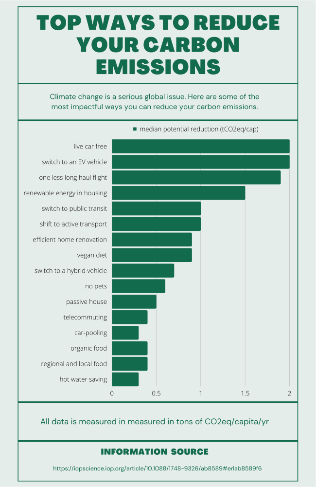
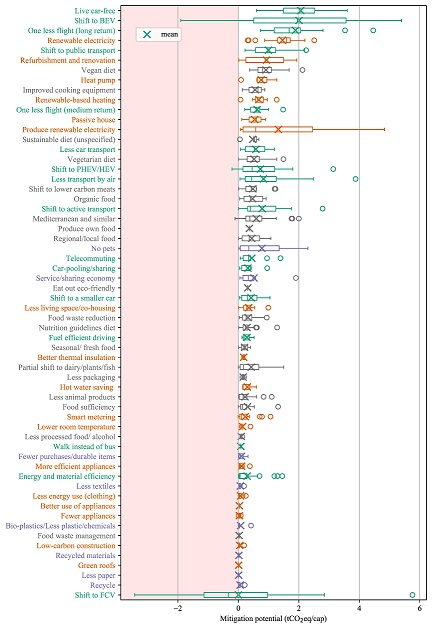

<!-- See the link below for markdown examples with this template -->
<!-- https://github.com/pages-themes/cayman/blob/master/index.md -->
## Top ways to reduce carbon emissions

> Reduction is measured in metric tonnes of CO2 equivalent per year. Charts are plotted using the median values from the study. All data sources cited below.

### References

[Source](https://iopscience.iop.org/article/10.1088/1748-9326/ab8589#erlab8589f6)

Example of reference data from the acedemic study on carbom emissions used for the infograpic seen above:

---
